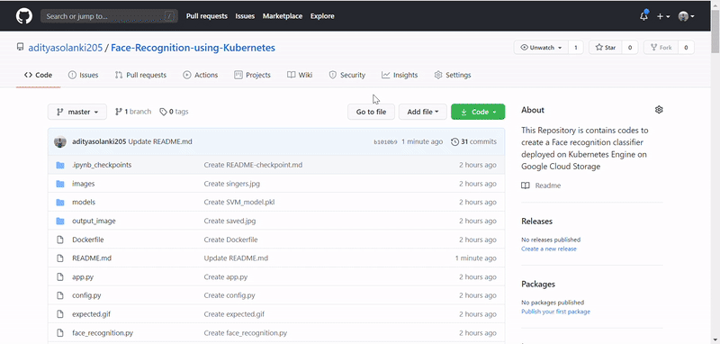
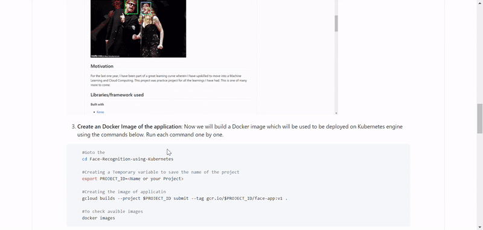
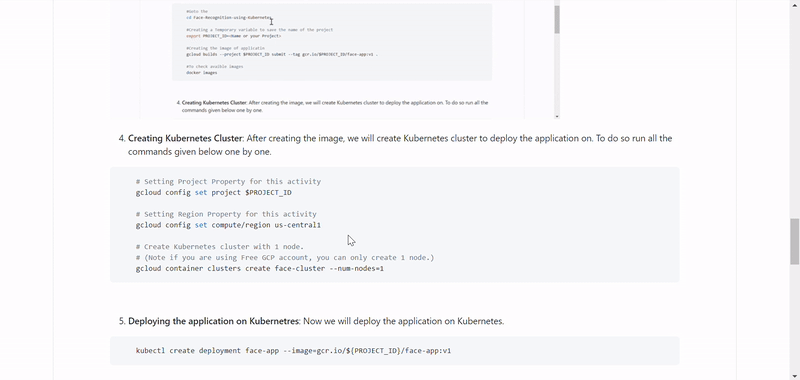
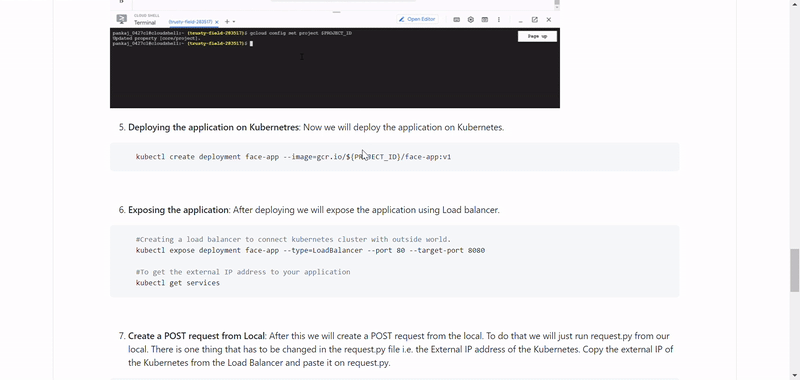
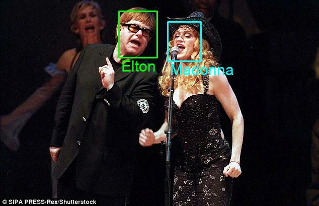

# Facial Recognition using Kubernetes

This is a Facial Recognition application developed for **learning and implementation purpose only**. In this repository we will just implement this application using Flask Architecture to run it on Google Kubernetes Engine. This model is trained to detect and recognise faces of six individuals namely Aditya Solanki(Author), Ben Affleck, Madonna, Elton John, Jerry Seinfled, Mindy Kaling. The repository for training and testing this model can be found [here](https://github.com/adityasolanki205/Face-Recognition). This Repository is divided into 3 major parts:

1. **To Create Docker Image of the Application**
2. **To Create Kubernetes Cluster to deploy the image**
3. **To Create a POST request to recognize faces**


## Motivation
For the last one year, I have been part of a great learning curve wherein I have upskilled to move into a Machine Learning and Cloud Computing. This project was practice project for all the learnings I have had. This is one of many more to come. 
 

## Libraries/framework used

<b>Built with</b>
- [Keras](https://keras.io/)
- [TensorFlow](https://www.tensorflow.org/)
- [scikit-learn](https://scikit-learn.org/stable/)
- [Flask](https://flask.palletsprojects.com/en/1.1.x/)
- [Google Kubernetes Engine](https://cloud.google.com/kubernetes-engine)


## How to use?

Below are the steps to setup the enviroment and run the codes:

1. **Cloud account Setup**: First we will have to setup free google cloud account which can be done [here](https://cloud.google.com/free). We will be using a Photo to Elton John and Madonna as an input image


2. **Copying the repository in SDK**: Now we have to create a Image to deploy the application on GCP. To do that we will use **cloud sdk**. To copy the application we will clone the repository in the cloud SDK with the command given below.

```bash
    git clone https://github.com/adityasolanki205/Face-Recognition-using-Kubernetes.git
```


3. **Create an Docker Image of the application**: Now we will build a Docker image which will be used to be deployed on Kubernetes engine using the commands below. Run each command one by one.

```bash
    #Goto the 
    cd Face-Recognition-using-Kubernetes
    
    #Creating a Temporary variable to save the name of the project
    export PROJECT_ID=<Name or your Project>
    
    #Creating the image of applicatin
    gcloud builds --project $PROJECT_ID submit --tag gcr.io/$PROJECT_ID/face-app:v1 .
    
    #To check avaible images
    docker images
```


4. **Creating Kubernetes Cluster**: After creating the image, we will create Kubernetes cluster to deploy the application on. To do so run all the commands given below one by one.

```bash
    # Setting Project Property for this activity
    gcloud config set project $PROJECT_ID 
    
    # Setting Region Property for this activity
    gcloud config set compute/region us-central1
    
    # Create Kubernetes cluster with 1 node. 
    # (Note if you are using Free GCP account, you can only create 1 node.)
    gcloud container clusters create face-cluster --num-nodes=1 
```


5. **Deploying and exposing the application on Kubernetres**: Now we will deploy the application on Kubernetes.

```bash
    #Deploy the application on Cluster created
    kubectl create deployment face-app --image=gcr.io/${PROJECT_ID}/face-app:v1
    
    #Creating a load balancer to connect kubernetes cluster with outside world.
    kubectl expose deployment face-app --type=LoadBalancer --port 80 --target-port 8080
    
    #To get the external IP address to your application(This can take some time to show the IP address
    kubectl get services
```


6. **Create a POST request from Local**: After this we will create a POST request from the local. To do that we will just run request.py from our local. There is one thing that has to be changed in the request.py file i.e. the External IP address of the Kubernetes. Copy the external IP of the Kubernetes from the Load Balancer and paste it on request.py. 

```python
    # Find Predict in Request.py file and 
    # paste the External IP address of the Kubernetes cluster here
    url = "http://<IP address from Kubernetes>:80/predict"
```
8. **See the magic happen**: Run Request.py from local 

```bash
    python request.py
```


**Note**: The boundary boxes are color coded:

    1. Aditya Solanki  : Yellow
    2. Ben Affleck     : Blue   
    3. Elton John      : Green
    4. Jerry Seinfield : Red
    5. Madonna         : Aqua
    6. Mindy Kaling    : White

## Credits
1. Special thanks to [Deploying ML Model](https://towardsdatascience.com/deploying-a-custom-ml-prediction-service-on-google-cloud-ae3be7e6d38f)
2. David Sandberg's facenet repo: [https://github.com/davidsandberg/facenet](https://github.com/davidsandberg/facenet)
3. Tim Esler's Git repo:[https://github.com/timesler/facenet-pytorch](https://github.com/timesler/facenet-pytorch)
4. Akash Nimare's README.md: https://gist.github.com/akashnimare/7b065c12d9750578de8e705fb4771d2f#file-readme-md
5. [Machine learning mastery](https://machinelearningmastery.com/how-to-develop-a-face-recognition-system-using-facenet-in-keras-and-an-svm-classifier/)
